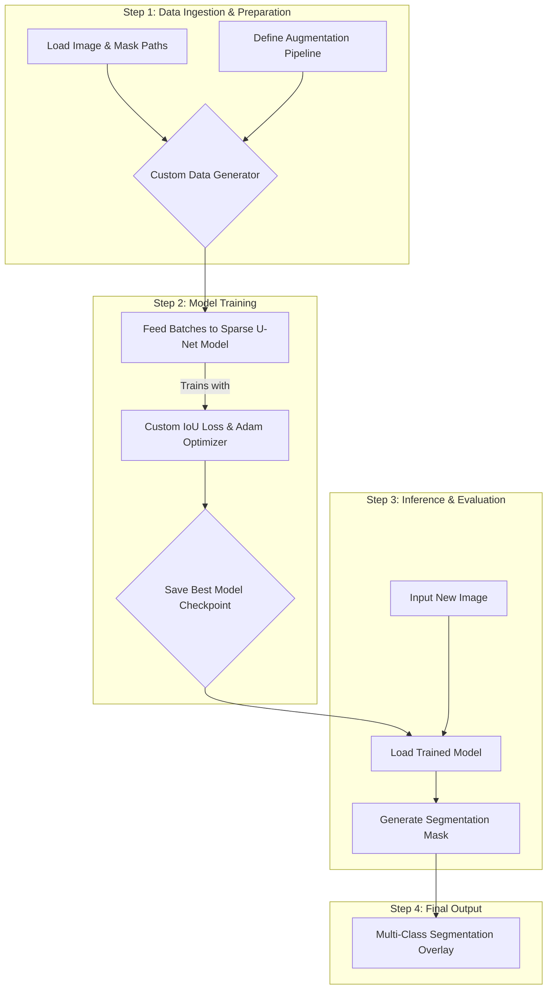

# Deep Learning for Prostate Cancer Segmentation

  

This project provides an end-to-end deep learning pipeline for the multi-class segmentation of prostate cancer Gleason grades from histology images, featuring a novel, attention-driven neural network architecture.

---

## Table of Contents
- [Key Features](#key-features)
- [Workflow Overview](#workflow-overview)
- [Prerequisites](#prerequisites)
- [Installation](#installation)
- [Usage](#usage)
- [Code Description](#code-description)
- [Author](#author)
- [License](#license)

---

## Key Features

* **Novel Sparse U-Net Architecture:** A custom-designed deep neural network with an encoder-decoder structure, incorporating advanced blocks like ResNeXt, Squeeze-and-Excite, and novel sparse connections for efficient feature propagation.
* **Robust Data Pipeline:** A custom `tf.keras.utils.Sequence` data generator for efficient, memory-friendly loading and preprocessing of large medical images.
* **Extensive Data Augmentation:** Utilizes the `albumentations` library to apply a wide range of on-the-fly augmentations, improving model generalization and robustness to variations in imaging conditions.
* **Multi-Class Segmentation:** The model is designed to output a multi-channel mask, with each channel corresponding to a specific Gleason grade or benign tissue.
* **Custom Loss Function:** Implements a custom IoU (Intersection over Union) loss function for direct optimization of the primary segmentation metric.

---

## Workflow Overview

The pipeline follows a systematic process to transform raw histology images into a trained segmentation model.



---

## Prerequisites

* **Python 3.9+**
* **TensorFlow 2.x**

---

## Installation

1. **Clone the repository:**
   ```bash
   git clone [https://github.com/your-username/prostate-segmentation.git](https://github.com/your-username/prostate-segmentation.git)
   cd prostate-segmentation
   ```

2. **Install the required Python libraries:**
   It is recommended to use a virtual environment.
   ```bash
   pip install tensorflow numpy opencv-python imageio albumentations matplotlib glob2
   ```

---

## Usage

1. **Directory Structure:**
   Ensure your data is organized in the expected directory structure. The script is configured to locate files based on a root directory.
   ```
   /root_folder/
   |
   |-- train_images/
   |   |-- image_01.jpg
   |   '-- ...
   |
   |-- train_masks/
   |   |-- image_01.png
   |   '-- ...
   |
   |-- valid_images/
   |   |-- image_101.jpg
   |   '-- ...
   |
   '-- valid_masks/
       |-- image_101.png
       '-- ...
   ```

2. **Configure the Script:**
   Open the `config.py` file to adjust paths, model hyperparameters (e.g., `BATCH_SIZE`, `EPOCHS`), and other settings.

3. **Run the script:**
   ```bash
   python train.py
   ```
   The script will build the model, create the data generators, and start the training process, saving the best model checkpoint based on validation performance.

---

## Code Description

* `config.py`: Central configuration file for paths, model hyperparameters, and data settings.
* `data_loader.py`: Contains the custom `DataGenerator` class and the `albumentations` pipelines for data augmentation and preprocessing.
* `model.py`: Defines the novel Sparse U-Net architecture, including all custom blocks like `sparse_block` and `resnext_block`.
* `utils.py`: Includes utility functions, such as the custom `iou_loss` and `mean_iou` metric.
* `train.py`: The main script that orchestrates the entire training pipeline, from data loading to model fitting.

---

## Author

**Sarmad Mueen**

---

## License

This project is licensed under the MIT License.
